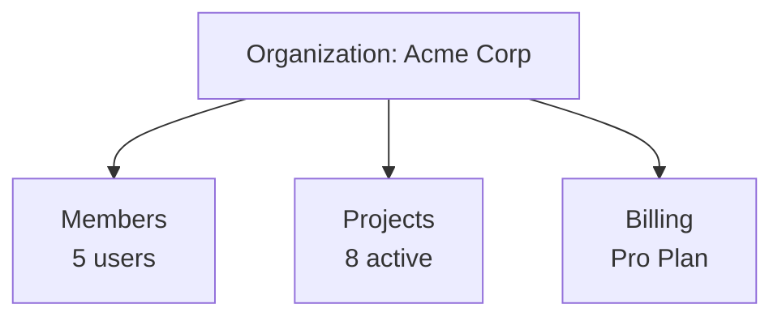

Organizations are the top-level entity in Suga. They serve as team workspaces where you manage projects, collaborate with team members, and handle billing.

## What is an Organization?

An organization represents your team or company:

- **Team Workspace** - Shared space for all team projects
- **Billing Entity** - Subscription and payment handled at org level
- **Access Control** - Invite members and assign roles
- **Audit Trail** - Every deployment tracked with who, when, and what

Every Suga account starts with a personal organization. You can create additional organizations for teams or clients.

## Organization Structure

## Creating an Organization

<Steps>
  <Step title="Access Organization Menu">
    Click the organization dropdown in the top-left corner.
  </Step>

  <Step title="Create Organization">
    Select **New Organization** and enter a name.
  </Step>
</Steps>

## Roles and Permissions

Suga uses role-based access control with three built-in roles:

| Role | Description |
|------|-------------|
| **Owner** | Full control, including billing and removing other owners |
| **Admin** | Manage projects, team, and billing, cannot remove owners |
| **Member** | Create and deploy, view team |

<Note>
  Roles are set at the organization level and apply to all projects.
</Note>

### Permissions Matrix

| Permission | Owner | Admin | Member |
|------------|:-----:|:-----:|:------:|
| **Projects & Environments** |
| View projects/environments | ✅ | ✅ | ✅ |
| Create/edit projects | ✅ | ✅ | ✅ |
| Delete projects | ✅ | ✅ | ✅ |
| **Deployments** |
| View deployments | ✅ | ✅ | ✅ |
| Deploy/rollback | ✅ | ✅ | ✅ |
| **Team Management** |
| View members | ✅ | ✅ | ✅ |
| Invite/remove members | ✅ | ✅ | ❌ |
| Change roles | ✅ | Non-Owner | ❌ |
| **Organization** |
| Edit org settings | ✅ | ✅ | ❌ |
| **Billing** |
| Manage subscription | ✅ | ✅ | ❌ |
| View invoices | ✅ | ✅ | ❌ |

### Role Guidelines

**Owner** - Keep to 1-3 people (founders, CTO). Can make irreversible changes, including removing other owners.

**Admin** - Senior engineers and team leads who need full project access.

**Member** - Default role for developers. Can build and deploy but cannot manage the team.

## Inviting Team Members

<Steps>
  <Step title="Open Members">
    Click **Members** in the left sidebar.
  </Step>

  <Step title="Click Invite Member">
    Enter email address and select role.
  </Step>

  <Step title="Member Accepts">
    They receive an email invitation and gain access upon accepting.
  </Step>
</Steps>

<Note>
  Invited members don't count toward your seat limit until they accept.
</Note>

## Removing Team Members

When someone leaves the team:

<Steps>
  <Step title="Remove from Organization">
    Go to **Members** in the left sidebar, click the "..." menu next to the person, and choose **Remove**.
  </Step>

  <Step title="Rotate Secrets">
    If they had production access, rotate:
    - Database passwords
    - API keys
    - Registry credentials
  </Step>
</Steps>

<Warning>
  Seat count decreases immediately and billing adjusts at the next cycle.
</Warning>

## Changing Roles

Owners can change anyone's role. Admins can change Member and Admin roles (not Owners).

1. Go to **Members** in the left sidebar
2. Find the member
3. Click the "..." menu, choose **Change Role**, and pick the new role
4. Changes take effect immediately

## Billing

Pro plan uses seat-based pricing ($20/user/month):

- Each team member with any role counts as one seat
- Owners, Admins, and Members all count equally
- Billed monthly based on active seats

**Plan limits:** Member count, project count, compute, memory, storage, and replica caps all vary by tier. See [Plan Limits](/reference/limits) for the full breakdown, and [suga.app/pricing](https://www.suga.app/pricing) for current pricing.

## Organization Navigation

Organization pages live in the left sidebar:

- **Projects** - Every project in the organization
- **GitHub Integration** - Manage the Suga GitHub App and repository access
- **Usage** - Resource usage and costs for the current period
- **Members** - Invite, manage, and remove team members
- **Billing** - Subscription, invoices, and payment method
- **Cluster** - Cluster connection, shown only when you bring your own cluster
- **Organization Settings** - Organization name and other details

## Handing Over Ownership

There is no one-click ownership transfer. Hand over ownership in two steps:

<Steps>
  <Step title="Promote the New Owner">
    Go to **Members**, open the "..." menu next to the person, choose **Change Role**, and set them to **Owner**.
  </Step>

  <Step title="Step Down">
    From your own row in **Members**, open the "..." menu and choose **Leave Organization**, or ask the new Owner to change your role to Admin or Member.
  </Step>
</Steps>

<Note>
  An organization must always have at least one Owner, so promote the new Owner before you leave. Suga blocks the last Owner from leaving.
</Note>

## Common Questions

<AccordionGroup>
  <Accordion title="Can I have multiple organizations?">
    Yes. Switch between them using the dropdown in the top-left corner.
  </Accordion>

  <Accordion title="Can I delete an organization?">
    Not from the dashboard. Email [support@suga.app](mailto:support@suga.app) and we'll do it for you. Deletion permanently removes all projects, environments, deployments, and data, and it cannot be undone.
  </Accordion>

  <Accordion title="Do all members see all projects?">
    Yes, currently there are no per-project permissions. All members can access all projects within the organization. Enterprise custom permissions are coming soon.
  </Accordion>
</AccordionGroup>
