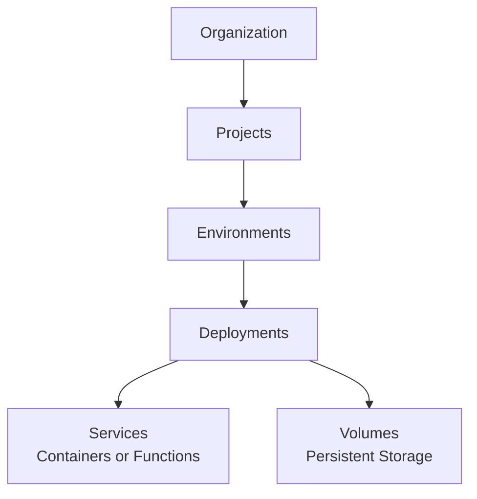

This section introduces the core concepts that make up Suga's architecture. Understanding these concepts will help you design and manage applications effectively.

<Frame>
  
</Frame>

## Hierarchy

Suga organizes infrastructure in a clear hierarchy:

### The Mental Model

Think of Suga as **applications, not servers**:

- You design what you want to run (services and volumes)
- You don't manage where or how it runs
- You focus on configuration and connections
- Suga handles provisioning, networking, and orchestration

<Note>
  Kubernetes powers Suga under the hood, but you never need to learn Kubernetes concepts or YAML files.
</Note>

## Key Concepts at a Glance

| Concept | Description | Example |
|---------|-------------|---------|
| **Organization** | Team workspace and billing entity | "Acme Corp" |
| **Project** | Application container | "Marketing Website" |
| **Environment** | Isolated deployment target | "production", "staging" |
| **Deployment** | Immutable snapshot of infrastructure | "Deploy #42 on Jan 28" |
| **Service** | Running workload (Container or Function) | "api", "frontend", "worker" |
| **Volume** | Persistent block storage | "postgres-data" (5 GB) |
| **Networking** | Public (HTTPS/TCP) or private (service discovery) | HTTPS domain or TCP proxy |

## Organizations

Organizations are team workspaces:
- The top-level entity in Suga
- Billing and subscription management
- Team member invitations and roles
- Own multiple projects

[Learn more about Organizations →](/concepts/organizations)

## Projects

Projects are application containers:
- Belong to one organization
- Have a display name you can change at any time, which does not have to be unique
- Are addressed by an internal ID, so renaming a project never changes its URL
- Contain multiple environments

[Learn more about Projects →](/concepts/projects)

## Environments

Environments are isolated deployment targets:
- Separate namespaces for production, staging, development
- Each has its own services and volumes
- Independent configuration and secrets
- Share the same project structure

<Info>
  Preview Environments (automatic PR environments) are coming soon in a future release.
</Info>

[Learn more about Environments →](/concepts/environments)

## Deployments

Deployments are immutable snapshots:
- Capture complete infrastructure state at a point in time
- Include all services, volumes, configuration, and networking
- Tracked in deployment history for rollback
- Only one deployment is active per environment

[Learn more about Deployments →](/operate/deployments)

## Services

Services are your running workloads:

<Tabs>
  <Tab title="Containers">
    **Docker-based service:**
    - Run any Docker image
    - Support for public and private registries
    - Configure commands and ports
    - Best for existing applications and standard workloads
  </Tab>

  <Tab title="Functions">
    **Serverless-style service:**
    - Write Deno/TypeScript code directly in Suga
    - Built-in code editor, no Docker build needed
    - Ideal for APIs and lightweight services
    - Automatically scaled and managed
  </Tab>
</Tabs>

All services support:
- Environment variables with secrets encryption
- Resource limits (CPU and memory)
- Horizontal scaling with replicas
- Public networking (HTTPS/TCP) and private networking (service discovery)

[Learn more about Services →](/concepts/services)

## Volumes

Volumes provide persistent storage:
- Block storage that survives restarts and redeployments
- Size limits vary by plan (check dashboard for current limits)
- Mount to services at specified paths
- Essential for databases and stateful applications

<Warning>
  Volumes can only be mounted to one service at a time, and that service must have exactly 1 replica.
</Warning>

[Learn more about Storage →](/configure/volumes)

## Networking

Suga offers two networking modes:

**Private Networking (Service Discovery):**
- Automatic DNS-based discovery
- Services communicate using service names
- Format: `service-name:port`
- Example: `postgres:5432`, `redis:6379`

**Public Networking:**
- **HTTPS Endpoints** - Port 443 with automatic TLS and domains
- **TCP Proxy** - Non-HTTP protocols like PostgreSQL or SSH
- Automatic load balancing across replicas

[Learn more about Networking →](/configure/networking)

## Templates

Templates are pre-configured project resources:
- Vetted configurations for common services
- Auto-fill images, ports, volumes, and environment variables
- Available for databases, frameworks, and tools
- Save time with best-practice defaults

[Learn more about Configuration →](/reference/configuration)

## Next Steps

Explore each concept in depth:

<CardGroup cols={2}>
  <Card title="Organizations" icon="building" href="/concepts/organizations">
    Team workspaces and billing
  </Card>
  <Card title="Projects" icon="folder" href="/concepts/projects">
    Application containers
  </Card>
  <Card title="Environments" icon="layer-group" href="/concepts/environments">
    Isolated deployment targets
  </Card>
  <Card title="Deployments" icon="rocket" href="/operate/deployments">
    Immutable infrastructure snapshots
  </Card>
  <Card title="Services" icon="server" href="/concepts/services">
    Containers and functions
  </Card>
  <Card title="Networking" icon="network-wired" href="/configure/networking">
    Public and private networking
  </Card>
  <Card title="Storage" icon="database" href="/configure/volumes">
    Persistent storage
  </Card>
  <Card title="Configuration" icon="gear" href="/reference/configuration">
    Templates and settings
  </Card>
</CardGroup>
