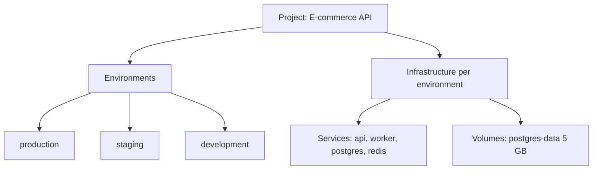

Projects are the primary organizational unit in Suga. Each project represents a complete application with all its services, databases, and infrastructure.

## Key Features of a Project

A project contains your application:

- **Logical Boundary** - Groups related services and infrastructure
- **Multiple Environments** - Each project has production, staging, dev, etc.
- **Canvas Workspace** - Visual design space for your infrastructure
- **Deployment History** - Complete record of infrastructure changes per project
- **Version Control** - Every change tracked with commit messages and author

Think of a project as one complete application, like "Marketing Website", "E-commerce API", or "Internal Dashboard".

## Project Structure

## Creating a Project

Create a new project from the dashboard. Give it a descriptive name. A production environment is created automatically with full deployment tracking.

## Project Settings

Access project settings from the project dropdown menu. Settings are minimal and focused on project identity:

### General

- **Project Name** - Change the display name shown in the dashboard
- **Description** - Optional description for the project

### Delete Project

Permanently delete the project and all its data. This action is in the danger zone section at the bottom of settings.

<Warning>
  Deleting a project permanently deletes all environments, deployments, services, volumes, and data. This action cannot be undone.
</Warning>

## The Canvas

Every project has a visual canvas where you design infrastructure:

**Canvas Features:**
- Add services, volumes, and templates to your infrastructure
- Visual connections between services and volumes
- Real-time configuration panel
- Environment selector to switch between production/staging/dev
- Deploy button to push changes live

## Environments

Each project can have multiple environments (production, staging, development, preview, etc.) with isolated namespaces and independent configuration. See [Environments](/concepts/environments) for detailed information.

## Common Questions

<AccordionGroup>
  <Accordion title="Can I rename a project?">
    Yes, you can change the project name anytime in Project Settings.
  </Accordion>

  <Accordion title="Can I move a project to a different organization?">
    Not currently. You'll need to recreate the project in the target organization. Export your configuration from the canvas first.
  </Accordion>

  <Accordion title="How many services can I have in a project?">
    There's no hard limit on services per project. Resource availability depends on your plan.
  </Accordion>

  <Accordion title="What happens to deployments when I delete a project?">
    All deployments are immediately stopped and all data is permanently deleted. Make sure to back up any important data before deleting a project.
  </Accordion>
</AccordionGroup>

