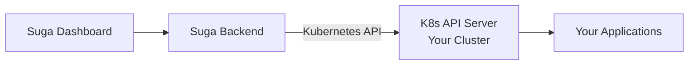

BYOC allows you to run Suga on your own Kubernetes infrastructure while using the Suga dashboard for management. You get full control over where applications run while maintaining Suga's simplicity.

<Note>
  **Enterprise Feature**: BYOC is available on the Enterprise plan.
</Note>

## BYOC vs Suga Cloud

| Aspect | Suga Cloud | BYOC |
|--------|------------|------|
| **Setup** | Zero infrastructure | You manage K8s cluster |
| **Control** | Suga manages | Full control |
| **Data Location** | Suga's infrastructure | Your infrastructure |
| **Regions** | US, Europe, Australia | Any region/cloud/on-prem |
| **Best For** | Most users | Enterprise, compliance, existing K8s |

## Prerequisites

- **Kubernetes 1.24+** with cluster-admin access
- **LoadBalancer support** - Cloud provider integration or MetalLB for bare metal
- **Default storage class** - Must support `ReadWriteOnce` access mode for volumes
- **Outbound internet access** - To pull container images and connect to Suga API

<Note>
  Suga automatically installs **Envoy Gateway** (Gateway API) and manages **TLS certificates** and **DNS records** during cluster initialization. You don't need to set these up.
</Note>

### Supported Platforms

GKE, EKS, AKS, self-managed, on-premises, DigitalOcean, Linode, Civo, and other K8s providers.

## Architecture



- **Direct API Connection** - Suga connects directly to your Kubernetes API server (no agent installed)
- **Encrypted Credentials** - Your cluster credentials are stored encrypted in Suga's database
- **Standard K8s API** - All operations use the Kubernetes REST API
- **Your Infrastructure** - Workloads and data run entirely in your cluster

## Setup

<Steps>
  <Step title="Add BYOC Cluster">
    In Suga dashboard: Org Settings → Cluster → Connect BYOC Cluster

    Follow the guided setup to provide your cluster credentials. The UI will walk you through entering your API server URL and authentication details.
  </Step>

  <Step title="Verify Connection">
    After adding, the dashboard should show "Connected" with a green indicator. Suga will automatically initialize the cluster with Envoy Gateway and required components.
  </Step>
</Steps>

<Tip>
  Need help connecting your cluster? [Contact support](/support/contact) for assistance.
</Tip>

## Namespaces

Suga creates namespaces for each environment:
- `suga-production`
- `suga-staging`
- `suga-dev`

## Direct Cluster Access

With BYOC, you have full kubectl access:

```bash
# List pods
kubectl get pods -n suga-production

# View logs directly
kubectl logs my-api-xxxxx -n suga-production

# Execute commands in pod
kubectl exec -it my-api-xxxxx -n suga-production -- /bin/sh

# Port forward for debugging
kubectl port-forward svc/postgres 5432:5432 -n suga-production
```

## Security Considerations

<AccordionGroup>
  <Accordion title="Credential Security">
    - Use a dedicated ServiceAccount with least-privilege permissions where possible
    - Rotate credentials periodically
    - Suga stores credentials encrypted at rest (AES-256-GCM)
    - All API communication is TLS-encrypted
  </Accordion>

  <Accordion title="Network Policies">
    Implement network policies to restrict traffic between namespaces. See Kubernetes documentation for examples.
  </Accordion>

  <Accordion title="Pod Security">
    Apply Pod Security Standards to Suga namespaces:
    ```bash
    kubectl label namespace suga-production \
      pod-security.kubernetes.io/enforce=baseline
    ```
  </Accordion>

  <Accordion title="Secrets">
    Suga stores secrets as Kubernetes Secrets. For enhanced security, use External Secrets Operator with your vault solution or enable Kubernetes encryption at rest.
  </Accordion>
</AccordionGroup>

## Cost

**Suga Platform:** Enterprise plan with custom pricing. [Contact us](/support/contact) for details.

**Your Infrastructure:** Kubernetes cluster costs depend on your cloud provider. Typical range: $100-1500+/month depending on size.
