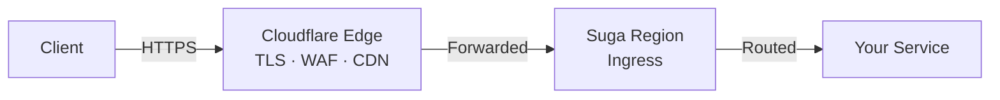

Public HTTPS requests to Suga services enter through Cloudflare's global edge before reaching the Suga region that hosts your environment. Cloudflare handles TLS, WAF, and CDN behavior at the edge; the region runs your service. TCP proxy traffic takes a different path (see [Request Path](#request-path)).

## Edge Network

HTTPS traffic to a Suga service is served through Cloudflare's global network, which has presence in over 300 cities. This applies to both auto-generated Suga domains and [custom domains](/reference/custom-domains).

**At the edge, Cloudflare provides:**
- TLS termination with automatically provisioned and renewed certificates
- WAF and DDoS protection
- Default Cloudflare zone behavior such as static asset caching and compression

Once the edge has handled the request, traffic is forwarded to the Suga region hosting your environment. See [HTTPS Endpoints](/concepts/networking#https-endpoints) for the service-level configuration.

## Regions

Suga Cloud runs workloads in three regions. Each organization is assigned to a region when its Suga Cloud account is set up, and every [environment](/concepts/environments) in that organization runs in the assigned region.

| Area | Region | Location |
|------|--------|----------|
| Americas | `us-central1` | Iowa, USA |
| Europe | `europe-west1` | St. Ghislain, Belgium |
| Asia-Pacific | `australia-southeast1` | Sydney, Australia |

<Note>
  All environments in an organization share the same region. To run workloads in multiple regions today, [contact support](/support/contact). Region migration and multi-region setup are handled manually.
</Note>

## Request Path

A public HTTPS request follows this path:



The client connects to the closest Cloudflare location, Cloudflare forwards the request to the regional ingress for the environment, and the ingress routes the request to one of your service replicas.

TCP proxy traffic skips the edge layer and connects directly to the regional load balancer, since Cloudflare's HTTPS edge does not apply to raw TCP. See [TCP Proxy](/concepts/networking#tcp-proxy).

## DNS Architecture

Suga manages DNS records on your behalf. You don't need to configure them. They're documented here so you can understand what gets created when you enable a public endpoint or attach a custom domain.

**Suga-generated HTTPS domains** resolve through Cloudflare to the regional ingress for the environment. This is what backs the auto-generated URL shown in the dashboard.

**Custom domains** use a CNAME target of the form:

```
<id>.cname.<region>.suga.run
```

You point your domain (e.g. `app.example.com`) at this target. Suga onboards the hostname through Cloudflare for SaaS, which means your domain inherits the same edge TLS, WAF, DDoS protection, and CDN behavior as Suga's own domains. See [Custom Domains](/reference/custom-domains) for the setup steps.

**TCP proxy endpoints** use a non-proxied DNS record so raw TCP traffic can reach the regional load balancer directly. The hostname is allocated automatically when you add a TCP proxy.

## TLS and Certificates

Suga handles TLS at two layers, with automatic provisioning and renewal at both. You never touch a certificate or a private key.

### Edge certificate (browser facing)

The certificate the visitor's browser validates is issued and renewed by Cloudflare:

- **Suga-generated domains** use the zone-level Cloudflare certificate.
- **Custom domains** use a per-hostname certificate issued through Cloudflare for SaaS. Domain ownership is verified automatically via HTTP DCV at the edge, so the standard flow needs no manual TXT records.

### Origin certificate (Cloudflare to Suga)

The regional ingress holds a single wildcard certificate that covers every Suga-generated hostname in the region. Where it's issued from depends on whether Cloudflare's edge sits in front of the region:

| Mode | Issuer | Validity | Notes |
|------|--------|----------|-------|
| Proxied (default for HTTPS) | **Cloudflare Origin CA** | 15 years | Trusted only by Cloudflare, which is the only client that ever connects to the origin |
| Direct | **Let's Encrypt** (DNS-01) | 90 days | Renewed automatically before expiry, validated against Cloudflare-hosted DNS |

DNS-01 validation lets Suga issue wildcard certificates without exposing a challenge endpoint on the public internet. The TXT records used during validation are written and removed automatically.

### Authenticated Origin Pulls

When traffic flows through Cloudflare, the regional ingress accepts only connections that present a valid Cloudflare-issued client certificate. Anything trying to bypass Cloudflare and reach the origin directly is rejected at the TLS layer, before any routing or application logic runs.

This guards against origin IP discovery attacks and means every byte that reaches your service was authenticated by the Cloudflare edge on top of clearing the WAF.

<Note>
  The origin certificate and the Cloudflare-issued client certificate together provide mutual authentication on the origin connection. There is nothing to configure. This is on by default for every HTTPS endpoint.
</Note>

## What Suga Manages vs What Cloudflare Manages

| Suga manages | Cloudflare manages |
|--------------|---------------------|
| DNS records for Suga and custom domains | Edge caching and cache rules |
| TLS certificate provisioning and renewal | Compression (gzip, brotli) |
| Regional routing to your environment | Image optimization |
| Custom hostname onboarding via Cloudflare for SaaS | Minification |

Whichever of these features are active depends on Cloudflare's zone configuration. Suga doesn't expose per-tenant overrides.

## Common Questions

<AccordionGroup>
  <Accordion title="Can I choose which region my organization runs in?">
    Yes. The region is selected when your Suga Cloud account is set up and applies to every environment in the organization. To change region after the fact, [contact support](/support/contact).
  </Accordion>

  <Accordion title="Can one organization run in multiple regions?">
    Not today. All environments in an organization share the same region. If you need workloads in more than one region, [contact support](/support/contact).
  </Accordion>

  <Accordion title="Can I configure caching or image optimization?">
    No. These behaviors are controlled by Cloudflare's zone configuration, and Suga doesn't expose per-tenant overrides.
  </Accordion>

  <Accordion title="Are more regions coming?">
    Yes. We add regions over time. [Contact support](/support/contact) if a specific region matters for your workload.
  </Accordion>
</AccordionGroup>

## Next Steps

<CardGroup cols={2}>
  <Card title="Networking" icon="network-wired" href="/concepts/networking">
    HTTPS endpoints, TCP proxy, and private networking
  </Card>

  <Card title="Custom Domains" icon="globe" href="/reference/custom-domains">
    Serve services from your own domain
  </Card>
</CardGroup>
